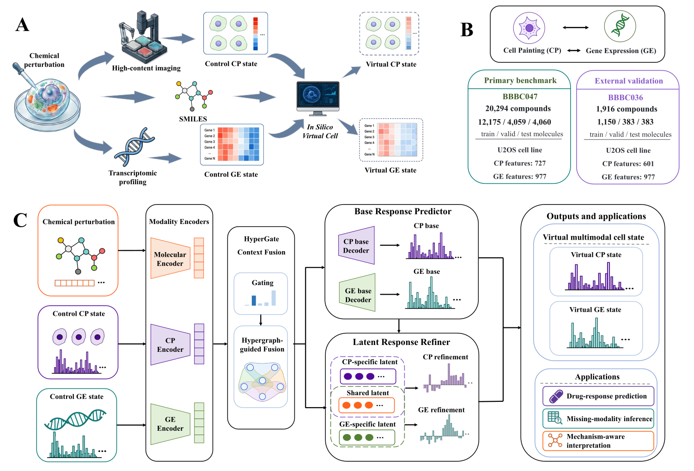
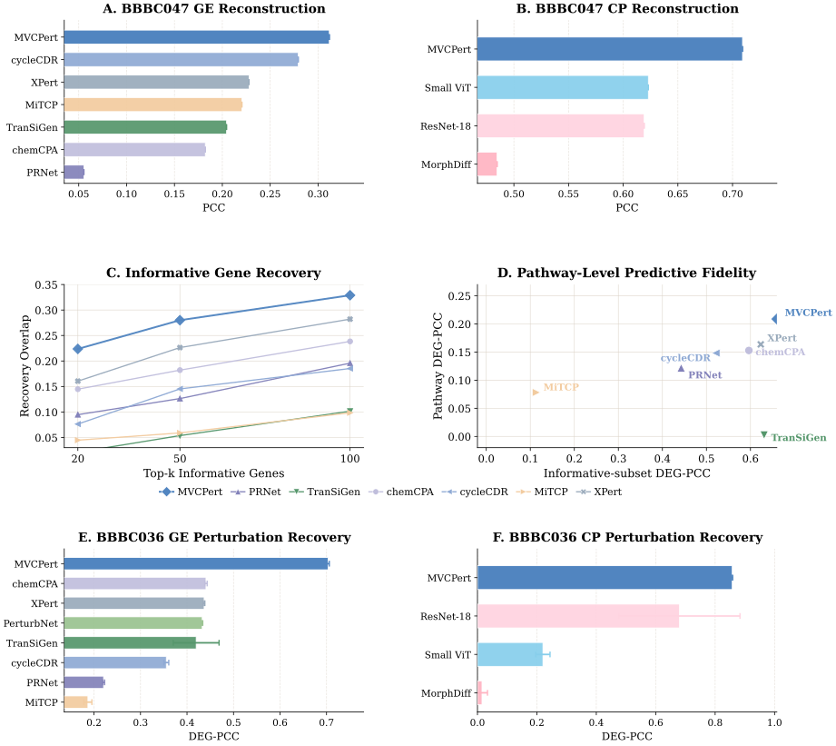

# <div align="center">MVCPert</div>

<p align="center">
  <strong>Multimodal virtual cell modelling of transcriptomic and morphological responses to chemical perturbations</strong>
</p>

<p align="center">
  
  
  
  
</p>

<p align="center">
  <a href="#overview">Overview</a> |
  <a href="#quick-start">Quick Start</a> |
  <a href="#results-snapshot">Results</a> |
  <a href="#repository-guide">Repository Guide</a> |
  <a href="#reproducibility-workflows">Workflows</a> |
  <a href="#code-map">Code Map</a> |
  <a href="#environment">Environment</a> |
  <a href="#data-and-external-artifacts">Data</a> |
  <a href="#citation">Citation</a>
</p>

MVCPert is a baseline-conditioned framework for predicting paired perturbed
**gene expression (GE)** and **Cell Painting (CP)** profiles from molecular
structure together with matched control cellular states. This reproducibility
package keeps the main training code, downstream analysis helpers, and
paper-facing figure generators in a lightweight public release so that the core
workflow is inspectable and reusable.

<p align="center">
  
</p>

## Overview

Most perturbation-response models target a single readout, typically gene
expression. MVCPert instead models coordinated regulatory and morphological
responses in a single framework. The method combines:

- **HyperGate multimodal fusion** to capture higher-order interactions among
  molecule, GE, and CP representations.
- **Residual latent response refinement** to model shared and modality-specific
  correction signals.
- **Benchmark-aware evaluation surfaces** for training, downstream response
  analysis, and paper figure regeneration.

This repository is intentionally **not** a full artifact mirror. Large HDF5
datasets, checkpoints, prediction profiles, latent files, and private run logs
remain external and are attached through documented environment variables.

## Quick Start

Run all commands from the repository root:

```bash
python -m pip install -r requirements.txt

# Optional CLI and import sanity check
python source/baseline/src/train_mvc.py --help

# Release hygiene check before sharing or publishing
python scripts/check_release_ready.py
```

For the main training path, configure external data and artifact roots:

```bash
export MVCPERT_BBBC047_H5=<DATA_ROOT>/BBBC047/Paired_CP_GE_Data_one_sample_per_molecule.h5
export MVCPERT_OUTPUT_BASE=<PROJECT_ROOT>/runs
export MVCPERT_ARTIFACT_ROOT=<ARTIFACT_ROOT>
export MVCPERT_DATA_ROOT=<DATA_ROOT>
export MVCPERT_AIDD_ROOT=$PWD/source
```

Then use the stable wrappers:

```bash
bash scripts/run_mvcpert_main.sh --dev cuda:0
bash scripts/regenerate_figures.sh
```

## Results Snapshot

The most suitable result preview for the repository homepage is the main
multimodal benchmark summary, because it communicates both the task setting and
the empirical scope without depending on external artifact-heavy case studies.

<p align="center">
  
</p>

Figure 2 summarizes the core BBBC047 and BBBC036 evaluation view used in the
paper-facing release path. In this lightweight package, the Figure 2 and Figure
3 plots can be regenerated directly from the included small analysis tables,
while Figure 4 and Figure 5 still require external prediction artifacts and
metadata.

## Repository Guide

| Path | Purpose |
| --- | --- |
| `source/baseline/src/` | Core model, dataset, utilities, and the main training CLI. |
| `source/baseline/pathway_benchmark/` | Gene-level and pathway-level downstream evaluation helpers. |
| `source/figures/paper/` | Figure 2-5 scripts, lightweight local analysis tables, and final PDF outputs. |
| `configs/` | Main training argument presets. |
| `scripts/` | Stable wrappers for main training, figure regeneration, and release checks. |
| `assets/readme/` | SVG previews used by the GitHub project homepage. |

## Reproducibility Workflows

### 1. Main Training

```bash
bash scripts/run_mvcpert_main.sh --dev cuda:0
```

Main entry points:

- Training CLI: `source/baseline/src/train_mvc.py`
- HyperGate fusion model: `source/baseline/src/MVCModel_HyperGate.py`
- Residual response refiner: `source/baseline/src/model_MVC_residual_vae.py`
- Data loader: `source/baseline/src/dataset.py`
- Split lock: `source/baseline/artifacts/split_locks/BBBC047_smiles_split_seed3407_official_v1.json`

### 2. Figure Regeneration

```bash
bash scripts/regenerate_figures.sh
```

Figure support in this release:

- Figure 2: reproducible from included local analysis tables.
- Figure 3: reproducible from included local analysis tables.
- Figure 4: requires external prediction profiles and latent files.
- Figure 5: requires external prediction profiles, metadata, and replicate
  tables.

### 3. Downstream Analysis

Core downstream analysis helpers live under:

```text
source/baseline/pathway_benchmark/
```

Important entry points:

```bash
python source/baseline/pathway_benchmark/evaluate_bbbc047_gene_level_downstream.py --help
python source/baseline/pathway_benchmark/diagnose_bbbc047_model_fit_vs_pathway_gap.py --help
```

## Code Map

### Core Model and Training

| Component | Path | Notes |
| --- | --- | --- |
| Training entry point | `source/baseline/src/train_mvc.py` | Main CLI for training, validation, prediction export, and metric summaries. |
| HyperGate fusion model | `source/baseline/src/MVCModel_HyperGate.py` | Modality encoders, fusion layers, hypergraph refinement, and task heads. |
| Residual VAE refiner | `source/baseline/src/model_MVC_residual_vae.py` | Shared/private residual response module and missing-modality branches. |
| Base MVC model | `source/baseline/src/model_MVC.py` | Baseline multimodal model used by ablations. |
| Data loading | `source/baseline/src/dataset.py` | HDF5 loading, molecule features, normalization, and split utilities. |
| Utility functions | `source/baseline/src/utils.py` | Metrics, HDF5 helpers, and training utilities. |
| Split lock | `source/baseline/artifacts/split_locks/BBBC047_smiles_split_seed3407_official_v1.json` | Molecule-held-out split metadata. |

### Analysis

| Component | Path |
| --- | --- |
| Gene-level downstream evaluation | `source/baseline/pathway_benchmark/evaluate_bbbc047_gene_level_downstream.py` |
| Fit-vs-pathway diagnostic | `source/baseline/pathway_benchmark/diagnose_bbbc047_model_fit_vs_pathway_gap.py` |
| Shared pathway helpers | `source/baseline/pathway_benchmark/bbbc047_pathway_benchmark.py` |
| Pathway knowledge tables | `source/baseline/pathway_benchmark/knowledge/` |

### Figure Scripts

| Figure | Script | Included inputs |
| --- | --- | --- |
| Figure 2 | `source/figures/paper/figure2_multimodal/scripts/generate_figure2_multimodal.py` | Minimal local tables in `source/figures/paper/figure2_multimodal/analysis/` |
| Figure 3 | `source/figures/paper/figure3_architecture_ablation/scripts/generate_figure3_architecture_ablation.py` | Minimal local tables in `source/figures/paper/figure3_architecture_ablation/analysis/` |
| Figure 4 | `source/figures/paper/figure4_missing_modality_virtual_profiling/scripts/generate_figure4_missing_modality_virtual_profiling.py` | External prediction profiles and latent files |
| Figure 5 | `source/figures/paper/figure5_case_studies/scripts/generate_figure5_case_studies.py` | External metadata, prediction profiles, and replicate tables |

## Environment

The code was developed with Python 3.11 and PyTorch. For this lightweight
public release, the exact local machine environment is intentionally not baked
into the scripts.

Recommended setup:

```bash
conda create -n mvcpert python=3.11
conda activate mvcpert

# Install a CUDA-enabled PyTorch build first if GPU training is needed.
# See https://pytorch.org/get-started/locally/ for the command matching your CUDA version.

python -m pip install -r requirements.txt
```

Key dependencies for replotting and analysis include `numpy`, `pandas`,
`matplotlib`, `scipy`, `scikit-learn`, `h5py`, `pyarrow`, and `rdkit`. Model
training additionally requires `torch`. The main training workflow is intended
for GPU use; CPU mode is suitable for CLI validation but not for realistic
full-scale reruns.

## Data and External Artifacts

The paired GE-CP benchmarks used in this repository follow the public Rosetta
release and its companion preprocessing resources. In particular, our released
workflow uses the `CDRP-BBBC047-Bray-CP-GE` and `CDRPBIO-BBBC036-Bray-CP-GE`
resources documented in these public GitHub sources:

- [broadinstitute/cellpainting-gallery](https://github.com/broadinstitute/cellpainting-gallery):
  official Cell Painting Gallery index, including the paired `cpg0003-rosetta`
  release and the CDRP aliases covering `BBBC036` and `BBBC047`.
- [carpenter-singh-lab/2022_Haghighi_NatureMethods](https://github.com/carpenter-singh-lab/2022_Haghighi_NatureMethods):
  public preprocessing and benchmark packaging repo that explicitly lists both
  `CDRP-BBBC047-Bray-CP-GE` and `CDRPBIO-BBBC036-Bray-CP-GE`.
- [gigascience/paper-bray2017](https://github.com/gigascience/paper-bray2017):
  companion repository for the 30,000-compound CDRP morphology source
  collection underlying the BBBC047 release.

The expected external layout is:

```text
<DATA_ROOT>/
  BBBC047/
    Paired_CP_GE_Data_one_sample_per_molecule.h5
    Paired_CP_GE_Data.h5
    merged_repurposing.csv
    Step2_CP_cleaned.parquet
    Step2_GE_cleaned.parquet
    gene_map.csv
  BBBC036/
    Paired_CP_GE_Data_official.h5
```

Minimum required file for the main BBBC047 training run:

```text
<DATA_ROOT>/BBBC047/Paired_CP_GE_Data_one_sample_per_molecule.h5
```

Additional files used by selected analyses and figure regeneration:

```text
<DATA_ROOT>/BBBC047/Paired_CP_GE_Data.h5
<DATA_ROOT>/BBBC047/merged_repurposing.csv
<DATA_ROOT>/BBBC047/Step2_CP_cleaned.parquet
<DATA_ROOT>/BBBC047/Step2_GE_cleaned.parquet
<DATA_ROOT>/BBBC047/gene_map.csv
<DATA_ROOT>/BBBC036/Paired_CP_GE_Data_official.h5
```

Large training outputs and figure-side prediction artifacts should remain
outside the repository under `<ARTIFACT_ROOT>`. See
the repository. Common external outputs include:

```text
<ARTIFACT_ROOT>/.../best_model.pt
<ARTIFACT_ROOT>/.../run_summary.json
<ARTIFACT_ROOT>/.../predict/test_prediction_profile.h5
<ARTIFACT_ROOT>/.../predict/test_ps_all_views_prediction_profile.h5
<ARTIFACT_ROOT>/.../predict/test_ps_latents.npz
```

Do not commit these files to Git. Use `MVCPERT_ARTIFACT_ROOT` and
figure-specific environment variables to point scripts to local copies.

The main training HDF5 is expected to contain at least:

```text
canonical_smiles
control_CP
target_CP
control_GE
target_GE
```

If dose-aware features are enabled, include:

```text
pert_dose
```

The training code applies the split lock by canonical SMILES and estimates
normalization statistics on the training split.


